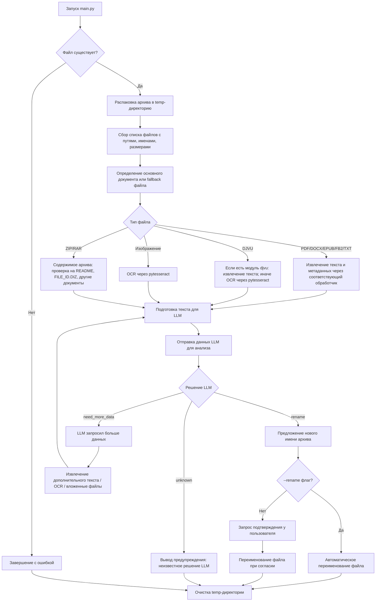

# Auto Archive Renamer & Analyzer

Автоматизированная система для анализа архивов и документов с последующим предложением корректного имени на основе содержимого. Поддерживает широкий спектр форматов документов, архивов и изображений с возможностью OCR.

---

## Предыстория

Как и у большинства айтишников, у меня в папках Downloads\Books и Downloads\Docs постепенно скопились сотни скачанных архивов «на потом». И со временем я понял, что просто невозможно вспомнить, что хранится в файлах с именами вроде 111.rar или 222.zip.

Так и родилась идея этой программы. Я не профессиональный разработчик, но имею базовое понимание программирования, поэтому сразу решил сделать систему модульной — чтобы легко подключать новые обработчики файлов.

Когда начали активно развиваться LLM, я понял, что могу использовать их возможности для автоматизации этой рутинной работы. Первые версии программы работали только на Python и предлагали пользователю самому выбирать, как переименовать файл на основе собранных данных.

В текущей версии реализовано не только чтение метаданных, но и распознавание текста на страницах отсканированных книг, где текст отсутствует в явном виде. Программа создавалась исключительно для моих личных нужд, так что если хотите переделать или расширить функционал — форкайте и экспериментируйте.

Если удастся найти серьёзные баги, я их исправлю и обновлю здесь. Что касается новых форматов и расширений — на данный момент программа охватывает всё, что мне нужно.

---

## Основные возможности

- Распаковка архивов (ZIP, RAR) и анализ содержимого.
- Определение основного документа в архиве.
- Извлечение текста из файлов разных форматов:
  - Документы: DOCX, PDF, EPUB, FB2, DJVU
  - Простые тексты: TXT
  - Изображения с текстом: PNG, JPG, TIFF, GIF
- Поддержка OCR через Tesseract для PDF, DJVU и изображений.
- Получение метаданных из поддерживаемых форматов.
- Взаимодействие с LLM (например, Google Gemini) для анализа текста и генерации предложенного имени архива.
- Возможность автоматического переименования через ключ `--rename`.

---

## Структура проекта

### Корневые файлы

- **archive_tools.py** – функции для работы с архивами: распаковка, получение структуры и метаданных.
- **config.py** – конфигурационные параметры проекта, пути и опции OCR.
- **file_tools.py** – утилиты для работы с файлами внутри архивов, извлечение текста и поиск файлов.
- **llm_client.py** – интерфейс для работы с LLM: отправка промптов и получение ответов.
- **main.py** – основной исполняемый файл; обработка архива, извлечение текста, взаимодействие с LLM, предложение переименования.
- **prompts.py** – генерация промптов для LLM: анализ архива и извлеченного текста.
- **requirements.txt** – список зависимостей проекта для установки через pip.

### Папка `formats/`

- **`__init__.py`** – регистрация всех обработчиков форматов и возврат подходящего обработчика для файла.
- **base_handler.py** – базовый абстрактный класс для всех обработчиков форматов.
- **djvu_handler.py** – обработка DJVU файлов, поддержка OCR через pytesseract.
- **docx_handler.py** – обработка DOCX/DOC файлов, извлечение текста и метаданных.
- **epub_handler.py** – обработка EPUB файлов, извлечение текста и метаданных, поддержка fallback метода.
- **fb2_handler.py** – обработка FB2 файлов, извлечение заголовка и текста.
- **image_handler.py** – обработка изображений с OCR (PNG, JPG, TIFF, GIF), поддержка русского и английского языков.
- **ocr_utils.py** – вспомогательные функции для OCR: конвертация DJVU/PDF страниц в изображения и вызов pytesseract.
- **pdf_handler.py** – обработка PDF файлов с использованием PyPDF2 и OCR для страниц с изображениями.
- **txt_handler.py** – обработка TXT файлов, извлечение первых символов или всего текста.
- **zip_handler.py** – обработка архивов ZIP и RAR, возвращает список содержимого.

---

## Установка

1. Клонировать репозиторий:

```bash
git clone https://github.com/username/repo.git
cd repo
```
2. Установить зависимости:

```bash
pip install -r requirements.txt
```
Для OCR необходимо установить Tesseract OCR и Pillow.

3. В файле config.py прописать свой API ключ к Gemini

4. Проверьте, есть ли у вас в стране доступ к Google Gemini - если нет, то придется искать VPN

## Использование

```bash
python main.py --file "archive.rar" [--rename]
```
- --file – путь к архиву для анализа.
  
- --rename – автоматически применять предложенное LLM имя архива. Если ключ не указан, программа спросит пользователя.

## Примечания

- Поддержка русского и английского языков для OCR.

- Если архив содержит только изображения или PDF с картинками, текст будет извлечен с помощью OCR.


## Логика работы программы

1. Пользовательский ввод

- Программа запускается через main.py с указанием файла-архива (--file) и опционально ключа --rename для автоматического переименования.

2. Проверка существования файла

- Если файл не найден, программа завершает работу с ошибкой.

3. Распаковка архива

- Используется библиотека patool для извлечения содержимого в временную директорию.

- Все файлы внутри архива собираются в список с их именами, путями и размерами.

4. Идентификация основного документа

- Модуль file_tools определяет, какой файл в архиве наиболее вероятно является основным (например, PDF, DOCX, EPUB, FB2, DJVU, или изображения).

5. Извлечение текста и метаданных

- Для каждого типа файлов вызывается соответствующий обработчик из папки formats/.

- Поддерживаются форматы: TXT, PDF, DOCX, FB2, EPUB, DJVU, архивы (ZIP/RAR) и изображения с OCR.

- Если текстовый слой отсутствует (например, сканированный PDF или DJVU), используется OCR через pytesseract.

- Также извлекаются метаданные: автор, дата создания, заголовок и т.д.

6. Отправка данных LLM

- Содержимое основного файла вместе с метаданными отправляется на обработку LLM через модуль llm_client.

- LLM анализирует данные и решает, что делать дальше:

  - rename — предлагает новое имя архива.

  - need_more_data — запрашивает извлечение большего объема текста для анализа.

7. Обработка решения LLM

- Если LLM предлагает переименовать файл:

  - При включенном ключе --rename файл автоматически переименовывается.

  - Иначе пользователю предлагается подтвердить переименование.

- Если LLM требует больше данных:

  - Программа извлекает текст по запросу и повторно отправляет его на LLM.

  - Процесс повторяется до получения окончательного решения.

8. Очистка временных файлов

- После анализа временная директория удаляется.


